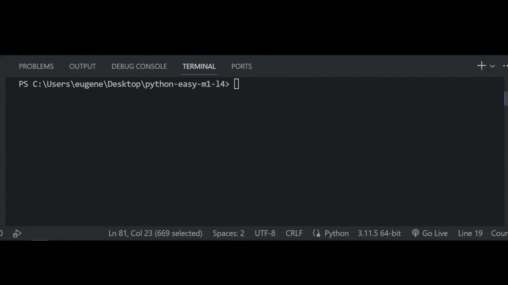

## Задача 10

##### Реши задачу

Бо отдал свой монитор в ремонт. Пока монитор находится в ремонте

он не может работать за своим устройством, решение которое нашел

Бо было в том, чтобы подключить телевизор как монитор. Бо нужно

было написать программу, которая заменит настройки монитора, на

настройки для экрана телевизора.

Замени параметры из второй строки на параметры первой строки.

После чего нужно каждый параметр вывести на экран предварительно

поместив в переменную. Изменить нужно только то что отличается.

## Результат

