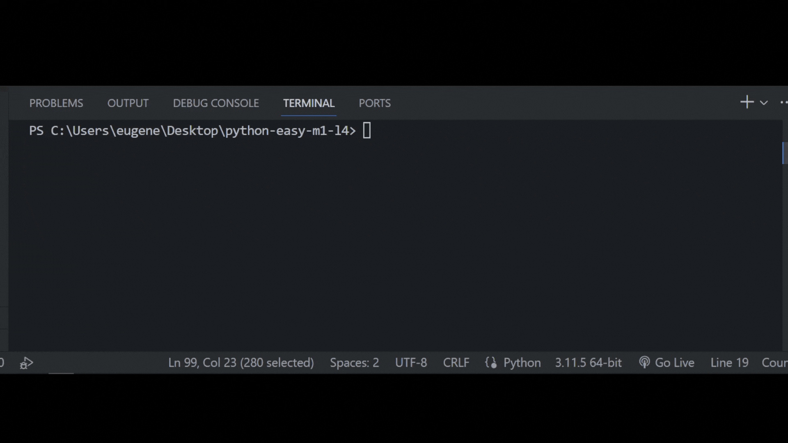

## Задача 11

##### Реши задачу

Бо случайно пролил кофе на ноутбук, из-за чего

клавиша Caps Lock перестала работать и выполнять

свою функцию, пока что у него нет возможности заменить

клавиатуру. Напиши для Бо программу, которая будет

принимать на вход одну букву и повышать ее регистр

когда программа включена, заменяя тем самым сломанную клавишу.

Для каждой букв нужно использовать input и upper.

## Результат

