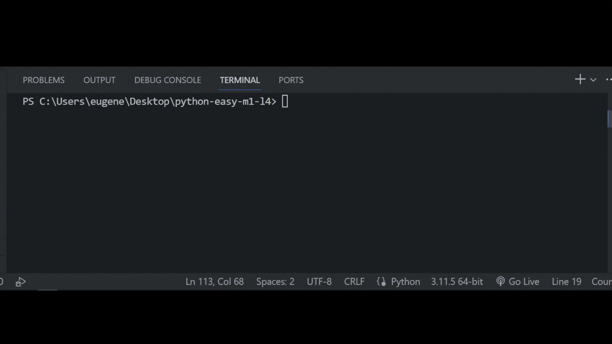

## Задача 12

##### Реши задачу

Бо писал код на выходных, чтобы улучшить свои

навыки программирования, он писал программу,

которая осуществляет в себе работу со всем что

Бо прошел за неделю. Напиши такую же программу.

Тебе нужно использовать:

`len `

`upper`

`lower`

`capitalize`

`срезы`

`конкатенацию`

`replace`

## Результат

