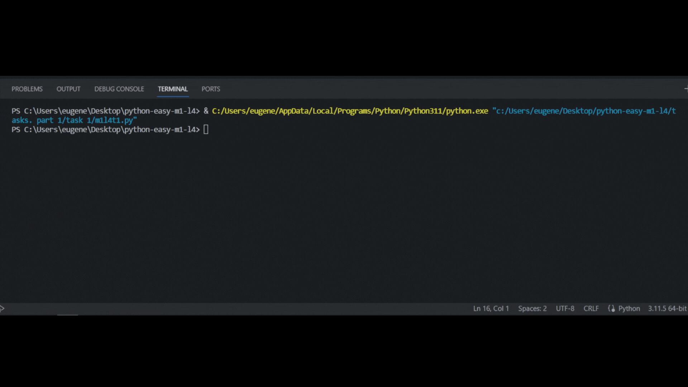

## Задача 2

##### Исправь ошибки в коде

На уроке по математике Бо решал задачу где нужно было

найти правильное место для постройки фундамента.

Математическая часть задачи была решена правильно, однако

Бо заметил что ответ на эту задачу Бо не может записать на сайт.

## Результат программы

