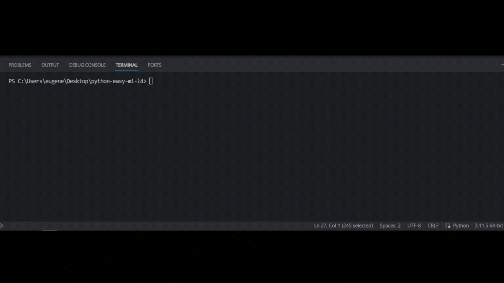

## Задача 4

Бо купил себе упаковку влажных салфеток, он решил прочитать инструкцию

по открытию упаковки на обратной стороне. Он попытался прочитать, но понял

что инструкция написана слишком мелко. Бо решил написать программу, которая

увеличит буквы и заменит старую инструкцию на новую.

Напиши программу, которая увеличит буквы за счет повышения регистра.

## Результат

