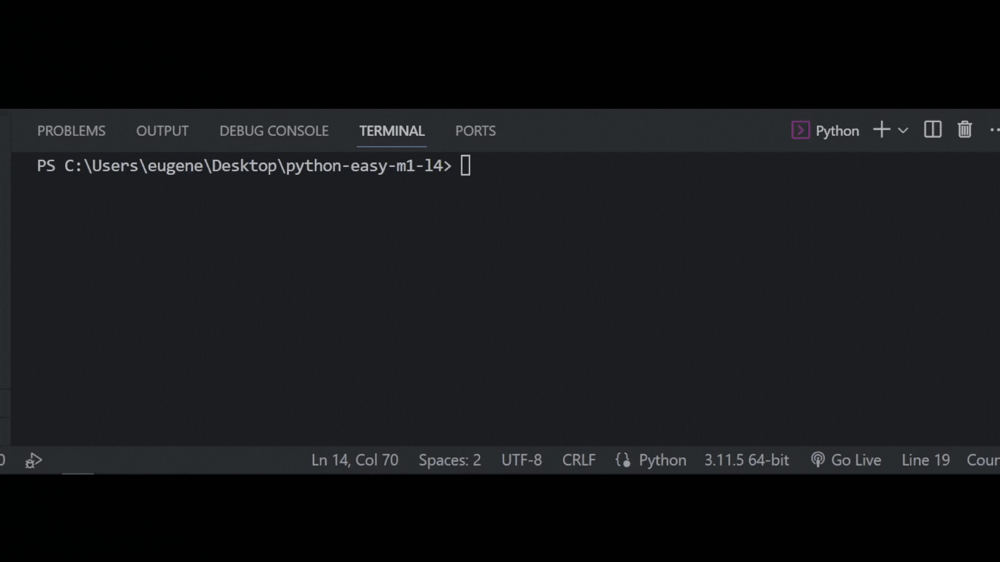

## Задача 5

##### Реши задачу

У старшеклассников академии, была идея по открытию

своего компьютерного клуба. Они попросили Бо о помощи

в написании программы задача которой, будет анализ.

Какая реклама привлекает внимания больше, та которая

написана в нижнем регистре или написанная в верхнем регистре.

Напиши программу, которая обработает строку с

притоком покупателей в зависимости от рекламы,

и выведет на экран количество клиентов от каждой рекламы.

## Результат

