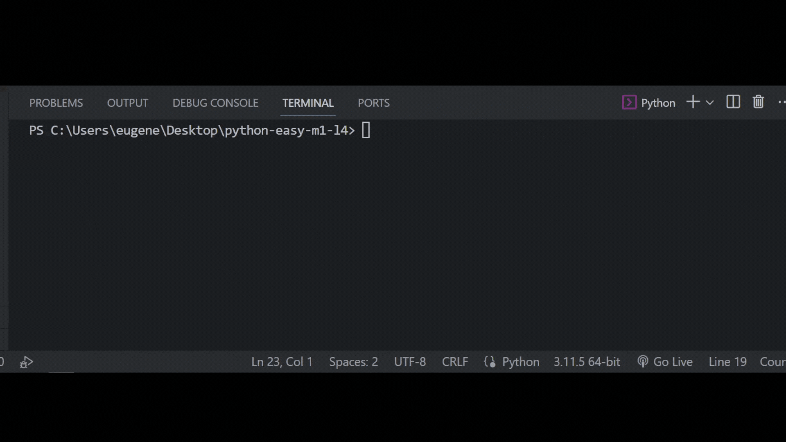

## Задача 6

##### Реши задачу

Бо сидел за своим рабочим столом в академии,

каждый компьютер был подключен к единой локальной

сети. Бо нужно было скинуть пару текстовых файлов

на компьютер коалы, вот только хоть компьютер и

был подключен к локальной сети, выдавало ошибку.

Он нашел файл, где прописаны названия всех

подключенных устройств, подстрой название

компьютера Бо под один формат с остальными.

## Результат

