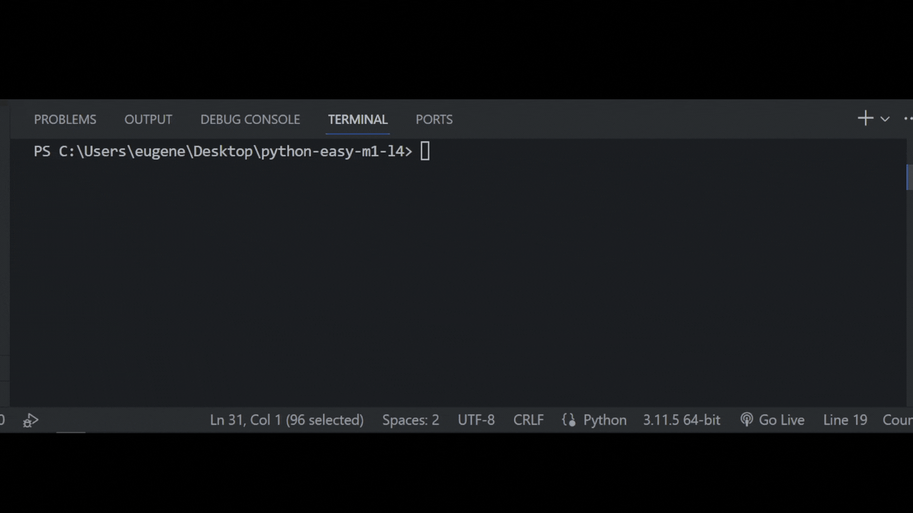

## Задача 7

##### Исправь ошибки в коде

Бо работал над своим проектом который он писал

в свободное время, это был голосовой помощник

"Керра". Бо думал над ошибкой возникшей в его

коде, из-за которой не получается обработать

запрос пользователя в виде строки.

Бо знает что для корректной обработки,

запрос должен начинаться с заглавной буквы,

помоги Бо это сделать.

## Результат

