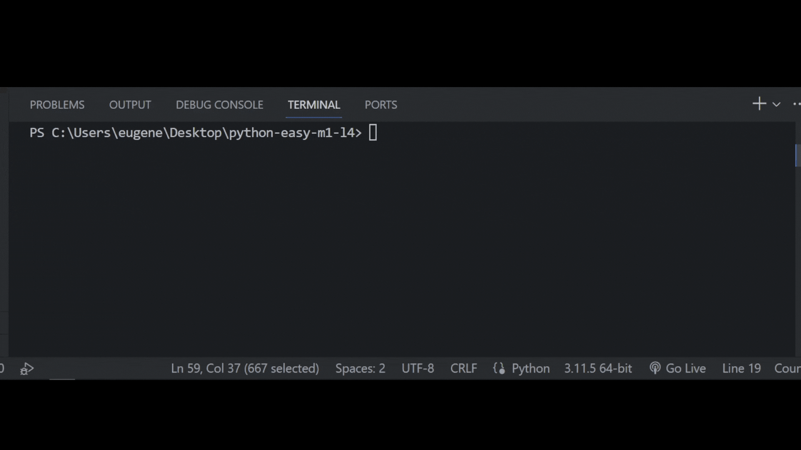

## Задача 9

##### Дополни код программы

Бо на уроке физкультуры решил опробовать новую беговую дорожку,

где он обнаружил табличку "тренажер не работает". Бо решил попробовать починить ее.

После некоторого времени, Бо выявил все поломки, в тренажёре сломались:

пульт управления

поворотный механизм

голосовое управление

динамик

Помоги Бо исправить программный код так, что бы беговая дорожка вновь была исправной

## Результат

