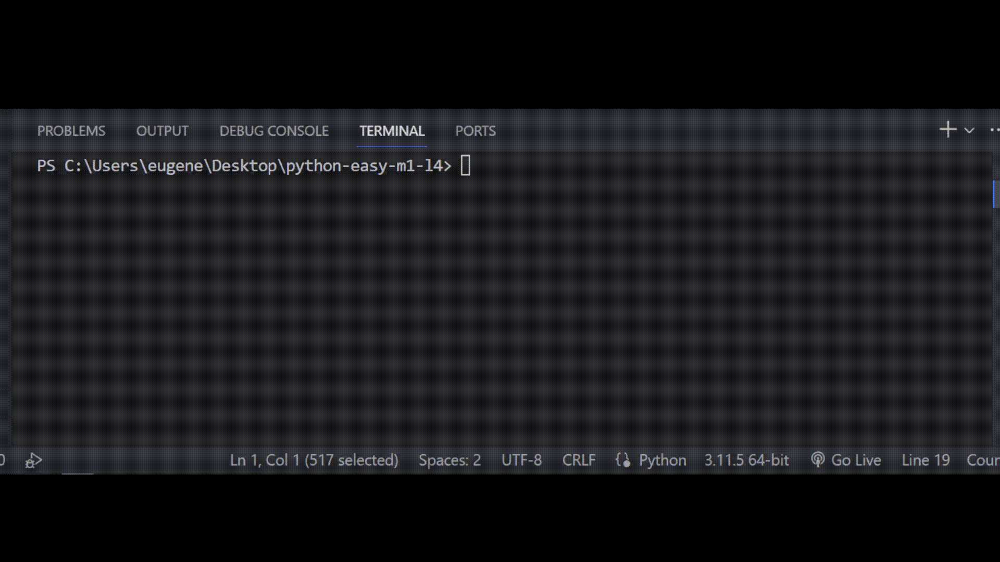

## Задача 1

##### Дополни код программы

Бо недавно проверял свои сохраненные файлы, он решил

взглянуть на свои старые экзамены, но у Бо все файлы

с учебы хранились в одной папке. Нужно написать

программу, которая откроет только те файлы, в начале

которых написано: "Экзамены"

## Результат

