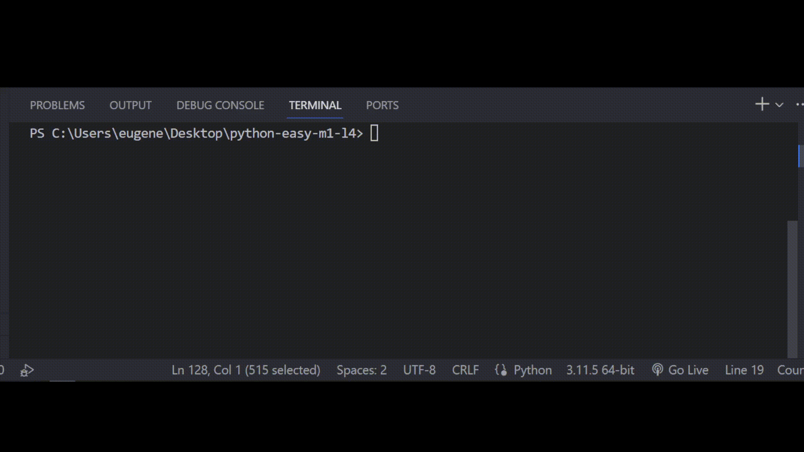

## Задача 10

##### Оптимизируй код программы

Бо недавно стало интересно как работают загрузка видео

в TikTok, он решил почитать об этом в интернете. Бо

примерно понял как она работают поэтому он решил

написать свою программу для этого, однако Бо заметил

что его программа работает куда медленнее, помоги Бо оптимизировать его код.

## Результат

