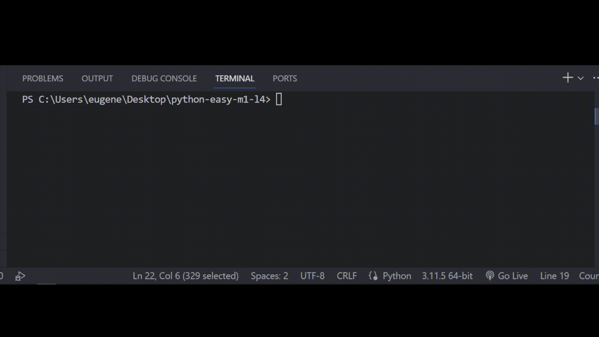

## Задача 2

##### Исправь ошибки в коде

Бо раньше любил читать разные комиксы, с течением

времени на его полке скопилось очень много разных комиксов, Бо

решил прибраться там и отсортировать часть комиксов. А

именно, он решил с помощью программы найти все первые части комиксов,

однако программа у Бо выдавала ошибку, помоги Бо исправить ошибку в коде.

## Результат

