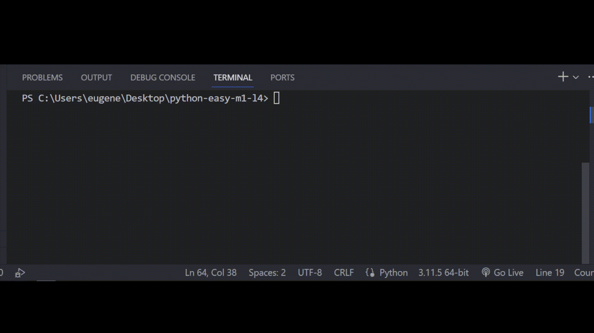

## Задача 5

##### Исправь ошибки в коде

Помогая в очередной раз знакомому с его игрой,

на этот раз, нужно как-то научить программу понимать

когда персанаж говорит с сарказмом, а когда нет,

чтобы реагировать по-разному.

На экран должны выводится только те фазы которые в конце имеют приставку: "сарказм"

## Результат

