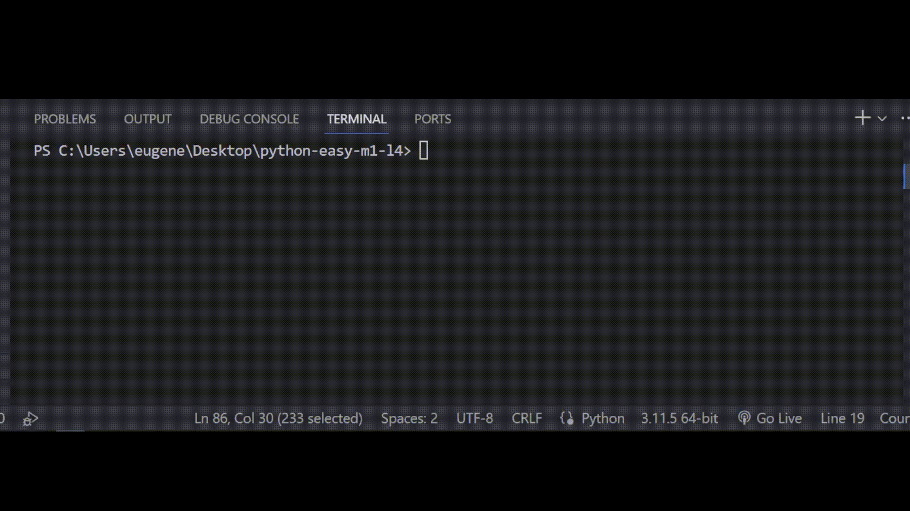

## Задача 7

##### Реши задачу

Бо собирал новую настольную лампу себе на

стол, тут вдруг Бо осознал что не знает можно

ли подключать 2 разных провода. Соединять

эти провода можно только при условии, что

начало первого провода имеет метку "+" а конец

второго провода имеет метку "-".

Помоги Бо написать программу, которая будет проверять эти провода.

## Результат

