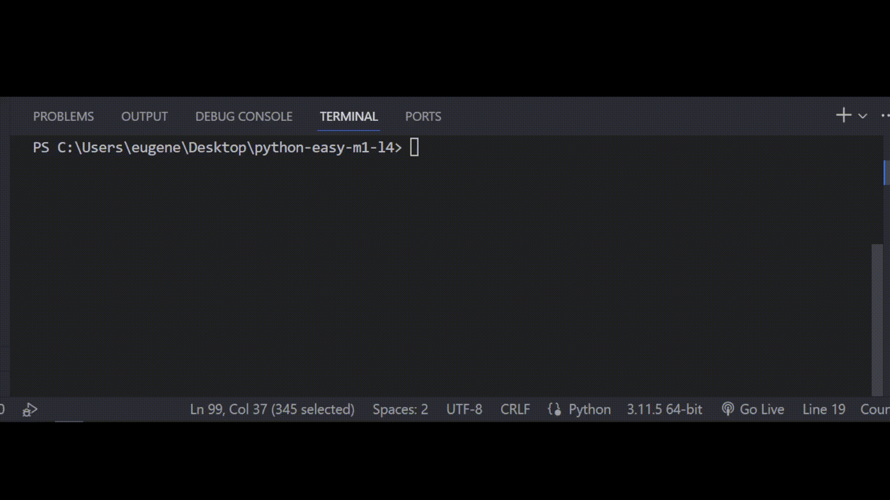

## Задача 8

##### Реши задачу

Коала при написании своего проекта обратилась к Бо за

помощью, Коала попросила помочь с обработкой запросов для

приложения. Приложение было сделано для доставки еды,

где нужно было проверять запрос пользователей на наличие

их специального кода. Помоги Бо написать программу которая:

- Разделит специальный код от основной строки и поместит в переменную
- Проверит, присутствует в конце "R"
- Проверит, начинается ли этот код с цифры "1"
- Выведет на экран длину кода
- Выведет, соответствует ли специальный код 2‑му и 3‑му требованию.

## Результат

