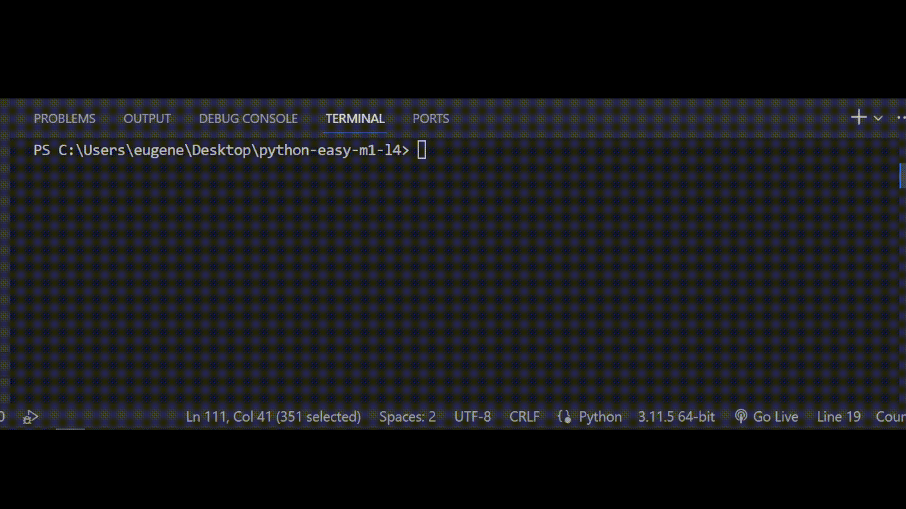

## Задача 9

##### Оптимизируй код программы

Бо написал программу, которая будет искать

подходящую по размеру одежду, Бо очень сложно

иногда самому находить одежду своего размера,

поэтому он решил сделать это через программу,

только вот Бо заметил что написанная им программа

работает медленно, помоги Бо оптимизировать код программы.

Строки кода которые не используются можно убрать.

## Результат

